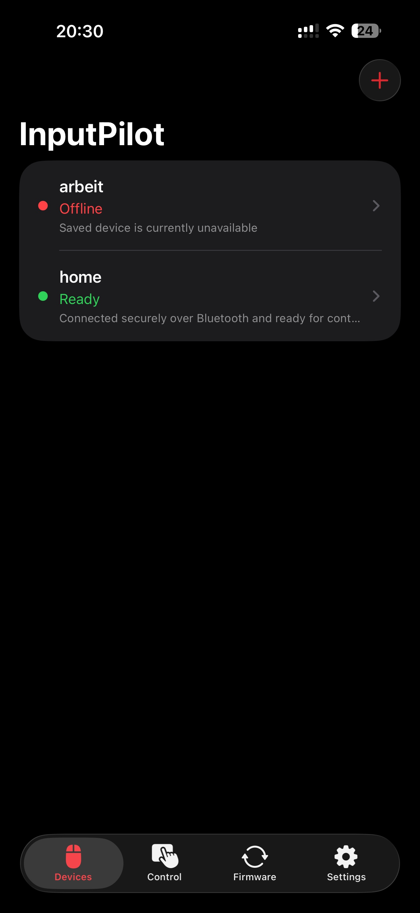
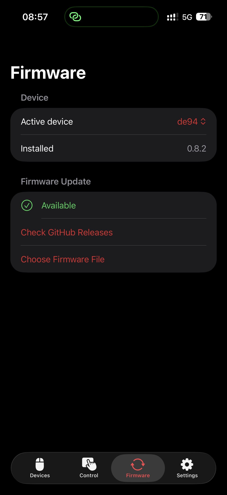

# InputPilot (iOS)

SwiftUI/SwiftData companion app for discovering and controlling **InputPilot** ESP32-S3 devices over BLE, persistent TCP, and local REST.

<p align="center">
  
  &nbsp;
  
</p>

## Security

**LAN and Soft-AP control can move the mouse and type on the host PC** attached to the device. Anyone on the same Wi‑Fi (or on the device’s open setup network during provisioning) can call the REST API unless you harden the firmware.

- Use only on **trusted networks** you control.
- Prefer home/lab Wi‑Fi; avoid public hotspots for provisioning or daily use.
- Optionally set **`CONTROL_API_TOKEN`** in firmware (`usb-hid-s3/include/wifi_secrets.h` or build flags) and enter the same token in the app’s device detail screen. When set, firmware requires `X-API-Token` on `/api/*` requests.
- See [`../SECURITY.md`](../SECURITY.md) for the full firmware threat model.

## Requirements

- Xcode 26 or newer (required for the iOS 26 SDK and native Liquid Glass rendering)
- iOS 17.0 deployment target
- macOS for building and Simulator testing
- **Firmware 0.6.1** for confirmed BLE/TCP authentication, ordered HID sessions, layout-resolved QWERTZ/QWERTY reports, and all remote capabilities. Older firmware remains usable through capability-aware fallbacks.

## Project layout

| Path | Purpose |
|------|---------|
| `InputPilot/` | App sources, assets, Info.plist |
| `InputPilotTests/` | Unit tests (API decoding, wizard state, etc.) |

## Build and run

### Xcode (recommended)

1. Open `InputPilot.xcodeproj` in Xcode.
2. Select the **InputPilot** scheme.
3. Choose **iPhone Simulator** (e.g. iPhone 17) or a connected device.
4. **Product → Run** (⌘R).

On first launch, iOS prompts for **local network** access — required for Bonjour discovery and HTTP control.

### Command line

```bash
cd ios
xcodebuild -project InputPilot.xcodeproj -scheme InputPilot \
  -destination 'platform=iOS Simulator,name=iPhone 17' build

xcodebuild -project InputPilot.xcodeproj -scheme InputPilot \
  -destination 'platform=iOS Simulator,name=iPhone 17' test
```

### Physical device — Soft-AP wizard

Path B of the add-device wizard uses `NEHotspotConfiguration` to join the firmware setup AP. On a **real iPhone**, your Apple Developer provisioning profile must include the **Hotspot Configuration** capability (`com.apple.developer.networking.HotspotConfiguration`). Without it, the wizard falls back to manual **Settings → Wi‑Fi** instructions.

Simulator cannot join Soft-AP networks; use Path A (LAN scan) or add-by-address for Simulator testing.

## Add-device wizard

Tap **+** on the home screen to open the wizard. Two paths:

| Path | When to use | Flow |
|------|-------------|------|
| **A — Scan local network** | Device already on your home Wi‑Fi | Bonjour browse `_http._tcp`, filter HID helpers, probe `/api/status`, confirm & save |
| **B — Set up new device (Soft‑AP)** | Fresh or unprovisioned device | Join firmware Soft-AP → read `/api/wifi` → POST home SSID/password → reconnect to home Wi‑Fi → rediscover on LAN (or enter address manually) |

Both paths share the same confirm/save step. Path B filters Bonjour results by `device_id` when firmware reports it.

Manual **Add by address** (toolbar) remains available for lab testing without discovery.

## Capabilities

Configured in `InputPilot/Info.plist`:

- Local network usage (Bonjour + HTTP to LAN devices)
- Bonjour service type `_http._tcp.`
- App Transport Security: local networking allowed

## Bundle ID

`com.mkflabs.inputpilot`

## Manual QA

Run on Simulator unless noted. Physical device required for Soft-AP join and the local-network prompt.

- [ ] **Unit tests** — `xcodebuild … test` (see above)
- [ ] **Empty state** — launch with no devices; empty copy and **+** visible
- [ ] **Add by address** — save a lab device by IP/hostname; list shows offline until refresh
- [ ] **Wizard Path A** — scan finds Bonjour candidate (or empty scan on Simulator); probe + save
- [ ] **Wizard Path B** (device) — join Soft-AP, provision home Wi‑Fi, rediscover or manual fallback
- [ ] **Jiggle toggle** — enable/disable on live device; host mouse moves when enabled
- [ ] **Rename** — detail screen display name persists after relaunch
- [ ] **Delete** — remove device from list and SwiftData
- [ ] **Pull to refresh / presence poll** — online/offline badges track reachability
- [ ] **API token** (optional) — with firmware `CONTROL_API_TOKEN` set, token in detail unlocks control
- [ ] **Local network prompt** — first Bonjour scan triggers iOS permission dialog
- [ ] **Remote controls** — complete [`../docs/HARDWARE_E2E.md`](../docs/HARDWARE_E2E.md), including two-board BLE identity, QWERTZ, scroll, preset/macro safety, and Liquid Glass checks
