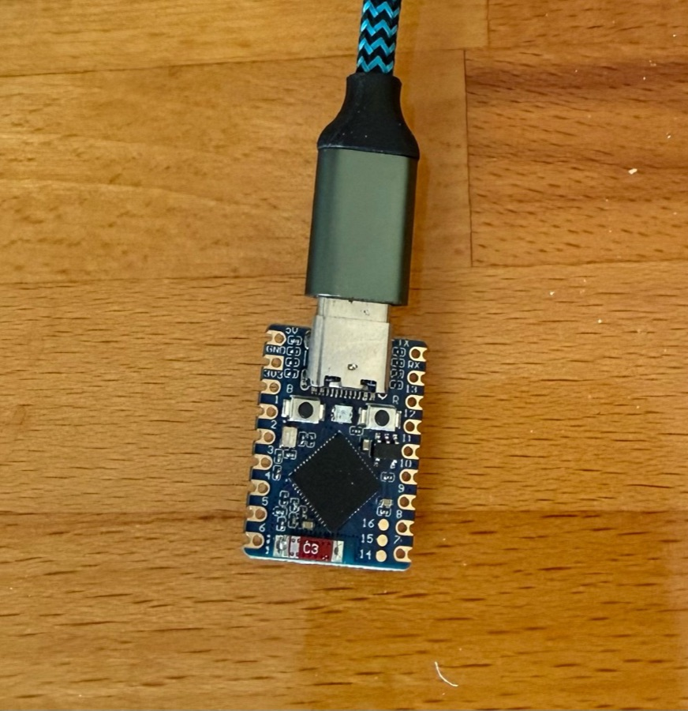

# Hardware

## Supported board

**Waveshare ESP32-S3-Zero / Mini** (ESP32-S3FH4R2):

- Dual-core Xtensa LX7 up to 240 MHz
- 4 MB flash, 2 MB PSRAM
- Native USB-OTG (USB-C)
- Onboard WS2812 RGB LED on **GPIO21**
- Ceramic antenna (WiFi + BLE)

Purchase example (3-pack):  
[Waveshare ESP32-S3 Mini on Amazon](https://a.co/d/0fwrWUFU)

Official Waveshare wiki / product page is also fine if you buy elsewhere — match
**ESP32-S3FH4R2**, **4 MB flash**, and the WS2812 on GPIO21 pinout.

## What you need

| Item | Notes |
|------|--------|
| ESP32-S3-Zero/Mini board | Above |
| USB-C data cable | Charge-only cables will not enumerate |
| Host PC | USB HID target (mouse/keyboard appear here) |
| Optional: phone/PC on WiFi | Soft-AP setup or STA REST control |

## Flash procedure (USB-OTG)

Auto-reset into download mode usually **fails** in native USB-OTG mode:

1. Hold **BOOT**, tap **RESET**, release **BOOT** (or unplug → hold BOOT →
   replug → release BOOT).
2. Upload firmware (`pio run -e esp32s3 -t upload` or `./scripts/deploy.sh`).
3. **Power-cycle** the board (unplug/replug) so the app boots in OTG mode.

After power-cycle the host should see USB identity **VID `0xCAFE` / PID `0x4001`**
(“S3 Mouse+Keyboard”), not Espressif’s JTAG CDC (`0x303A`).

`scripts/flash_and_verify.sh` waits for that enumeration after you power-cycle.

## Status LED

| Appearance | Meaning |
|------------|---------|
| Solid red | WiFi down / not associated |
| Magenta blink | Soft-AP setup (`usb-hid-s3-XXXX`; suffix from device MAC) |
| Dim solid green | STA up, jiggle off |
| Cyan breathing | STA up, jiggle on |
